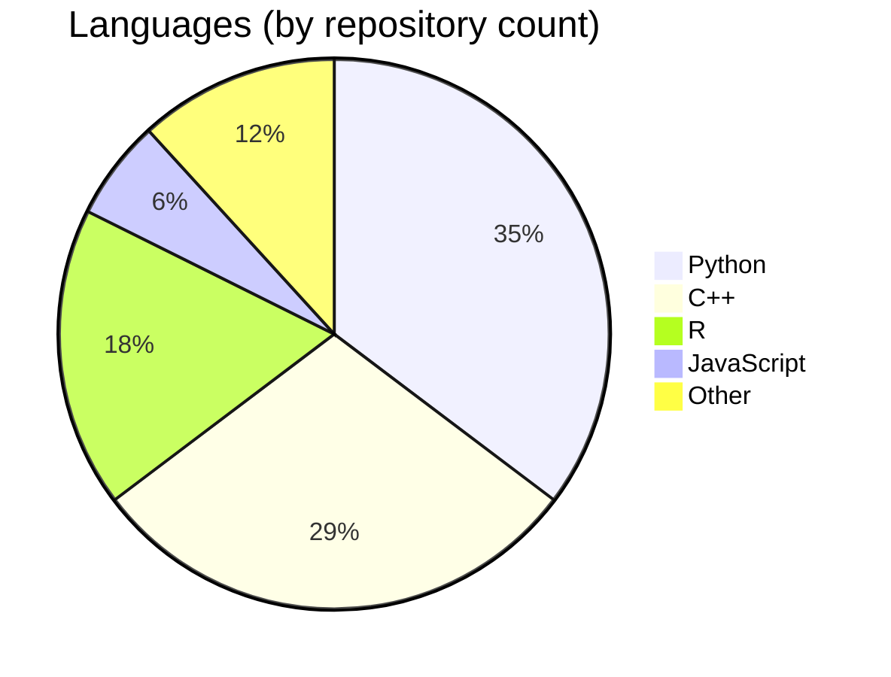

# Sarthak Hans

B.S. Computer Engineering · Minor in Management Information Systems, University of Illinois Chicago  
M.S. Artificial Intelligence (in progress), Florida Atlantic University

---

I build systems that connect data, APIs, and product surfaces. Right now that means Python automation, ML pipelines, and API integrations at Orangetheory Fitness — plus a 2-way SMS platform rollout and a handful of internal tools that replaced manual ops work. On the side, I'm finishing my MS in AI at FAU, where most of my projects land somewhere between data engineering and applied ML.

My background is in computer engineering with a business systems minor, so I tend to think about problems from both ends: what the data looks like and what a non-technical stakeholder actually needs to see.

---

## Projects

| Project | What it does | Stack |
|---|---|---|
| [MedGap](https://github.com/shans15/medgap) | 🏆 1st place FAU All of Us Hackathon — predicts psychiatric medication discontinuation and BH crisis risk; prescriber dashboard with SHAP explanations and auto-drafted patient outreach | XGBoost · SHAP · React · Vite · BigQuery |
| [qna-rag-chatbot](https://github.com/shans15/qna-rag-chatbot) | Upload docs or a URL, ask questions — full RAG pipeline with semantic search and a React frontend; deployed on AWS EKS | Python · FastAPI · LangChain · OpenAI · ChromaDB · React · AWS EKS · Terraform |
| [spotify-etl-pipeline](https://github.com/shans15/spotify-etl-pipeline) | End-to-end data pipeline: extract from Spotify API, transform, load to S3, query with Athena | Python · Spotify API · AWS S3 · Lambda · Glue · Athena |
| [CTA-L-Daily-Analytics](https://github.com/shans15/CTA-L-Daily-Analytics) | Chicago Transit ridership analysis with station rankings and trend visualizations | Python · SQLite |
| [DDPG-Pendulum](https://github.com/shans15/DDPG-Pendulum) | Deep Deterministic Policy Gradient agent on the inverted pendulum control task | Python · PyTorch |

---

## Languages

---

## Stack

**Languages** — Python, SQL, JavaScript / TypeScript  
**ML / Data** — XGBoost, PyTorch, LangChain, LangGraph, SHAP, Pandas, ChromaDB  
**APIs & Integration** — REST, FastAPI, Twilio, MBO API, Azure OpenAI, OpenAI, Groq  
**Cloud & Infra** — AWS (S3, Lambda, Glue, Athena, EKS), BigQuery, Docker, Terraform  
**Frontend** — React, Vite  
**Tools** — Git, PyCharm, Jupyter

---

## Currently

- TechOps Engineer @ Orangetheory Fitness — automation, API pipelines, internal tooling
- M.S. AI @ FAU — deep learning, reinforcement learning, AI systems
- Looking for Solutions Engineering and Data Engineering roles, with a focus on fintech

---

[linkedin.com/in/sarthakhans](https://linkedin.com/in/sarthakhans) · [github.com/shans15](https://github.com/shans15)
